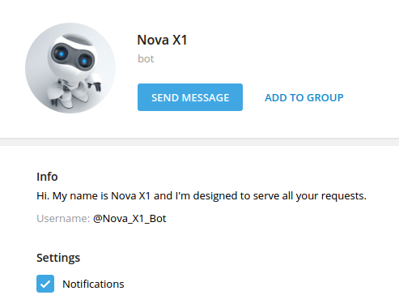
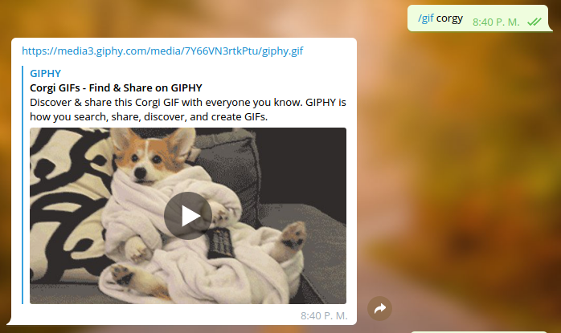
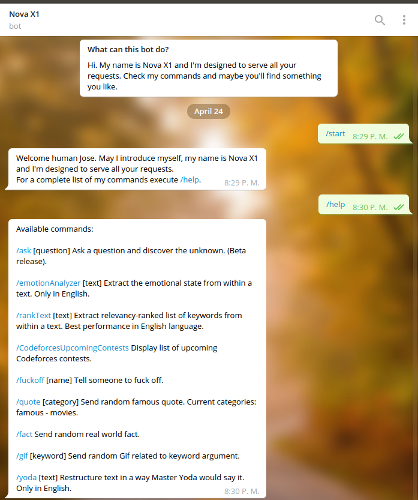

# Nova X1

## Description

Nova X1 is a personal assistant Telegram bot. It uses IBM Watson cognitive services and has a wide range of customizable commands.

<div align="center">
	
</div>

## Commands

## /ask

Type a question and Nova will try to answer based on similar Quora posts. Nova is not very accurate but in the end it became very funny those sporadic random answers.

## /emotionAnalizer

Extract the emotional state from within an English text. For this, Nova gets help from IBM Watson Sentiment Analysis.

## /rankText

Extract relevancy-ranked list of keywords from within a text. Best performance in English language. Uses Natural Language Processing from Watson.

## /CodeforcesUpcomingContests

Just because I really like Codeforces and competitive programming. Display list of upcoming Codeforces contests and stay up to dates.

## /quote [category]

Send random famous quote. Current categories: famous - movies.

## /fact

Send random real world fact.

## /gif [keyword]

Send random Gif related to keyword argument. Uses Giphy API to retrieve gifs.

## /yoda [text]

Restructure text in a way Master Yoda would say it. Only in English.

## /fuckoff [name]

Tell someone to fuck off. Uses pool of sentences.

Besides these commands, Nova is designed to be semi-interactive. By this, it is able to ask and answer very simple questions. Also, it is capable of saying hello and goodbye in many different ways and activate on specific keywords.

Finally, Nova also sends some random messages during the day to start conversation and comes with some hidden easter egg commands.

<div align="center" style="padding-bottom:10px;">
	
	
</div>

<div align="center" style="padding-bottom:10px;">
	
	
</div>

## License
```
Nova X1 is distributed under the terms of the GNU General
Public License version 2.
```

## Bug Reports
```
Any kind of bug reports are welcome.
If you find a bug in Nova X1, please send an email.

                                                 Jose Luis Acevedo
                                     joseluisacevedo1995@gmail.com
                                     	   jose.acevedos@in.tum.de
```